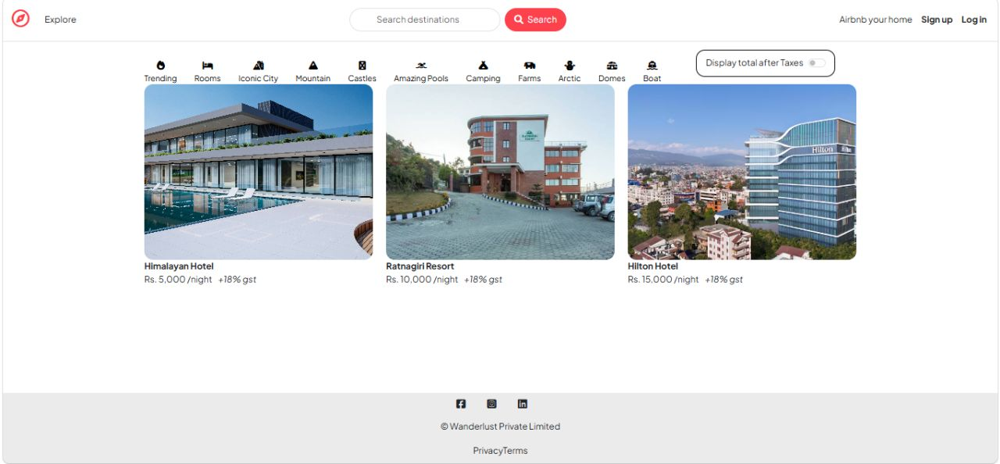
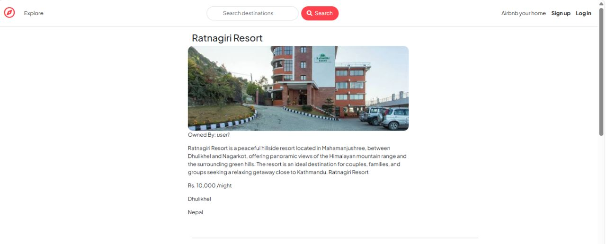
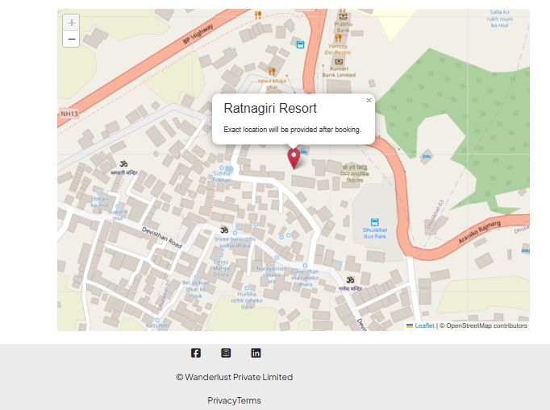
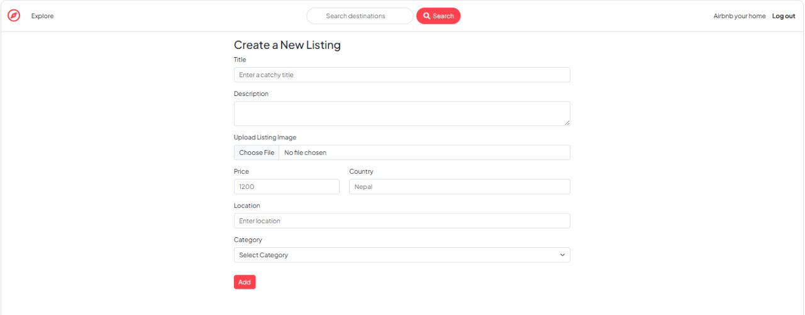

# 🏡 Wanderlust — Airbnb Clone

A full-stack Airbnb-inspired web application where users can browse, list, and review property stays. Built with Node.js, Express, and MongoDB, with cloud image hosting, secure authentication, and interactive maps.

**🔗 Live Demo:** [airbnb-project-56yu.onrender.com](https://airbnb-project-56yu.onrender.com/listings)

## 📸 Screenshots

### Homepage


### Listing Detail Page


### Location Map


### Create New Listing


### Reviews


---

## ✨ Features

- 🏠 **Browse listings** — view all property listings with images, pricing, and location
- 🗂️ **Category filters** — browse listings by category (Trending, Rooms, Iconic City, Mountain, Castles, Amazing Pools, Camping, Farms, Arctic, Domes, Boat)
- 📍 **Interactive maps** — each listing shows its location using Leaflet
- ➕ **Create, edit, and delete listings** — full CRUD for property hosts
- 🖼️ **Cloud image uploads** — listing photos are uploaded and served via Cloudinary
- 🔐 **User authentication** — secure signup/login with Passport.js (sessions stored in MongoDB via connect-mongo)
- ⭐ **Reviews and ratings** — users can leave star ratings and written reviews on listings
- ✅ **Server-side validation** — request data validated with Joi before hitting the database
- 💬 **Flash messages** — clear success/error feedback after user actions


---

## 🛠️ Tech Stack

**Backend:** Node.js, Express 5
**Database:** MongoDB, Mongoose
**Templating:** EJS, ejs-mate
**Authentication:** Passport.js (passport-local, passport-local-mongoose)
**File Storage:** Cloudinary, Multer
**Maps:** Leaflet
**Validation:** Joi
**Sessions:** express-session, connect-mongo, connect-flash
**Deployment:** Render

---

## 📂 Project Structure

```
├── controllers/     # Route logic (listings, users, reviews)
├── init/            # Database seeding scripts
├── models/          # Mongoose schemas (Listing, User, Review)
├── public/          # Static assets (CSS, client-side JS)
├── routes/          # Express route definitions
├── utils/           # Helper functions and error handling
├── views/           # EJS templates
├── app.js           # Application entry point
├── cloudConfig.js   # Cloudinary configuration
├── middleware.js     # Auth and validation middleware
└── schema.js         # Joi validation schemas
```
---

## 🎯 What I Learned / Built


- Designed a RESTful backend with full CRUD operations across multiple related MongoDB collections
- Implemented secure, session-based authentication and authorization with Passport.js
- Integrated a third-party cloud storage API (Cloudinary) for handling user-uploaded images
- Built server-side validation using Joi to prevent malformed data from reaching the database
- Deployed a production Node.js app to Render with environment-based configuration

---

## 🚀 Future Improvements

- [ ] Add a review and rating system for listings
- [ ] Add search and category filtering
- [ ] Add pagination for listings
- [ ] Write automated tests (Jest/Mocha)

---

## 👤 Author

**Sabina**

[LinkedIn](https://www.linkedin.com/in/sabina-shrestha-31865b313/) · [Portfolio](#) · [Email](mailto:shresthasabeena9@gmail.com)


